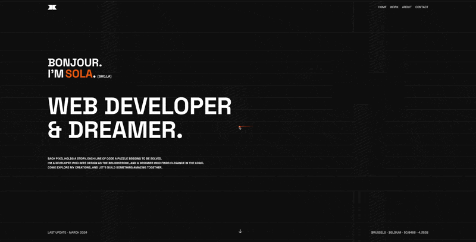

# My Portfolio
This is my personal portfolio website built with React, showcasing my skills and experience as a web developer.

### Technologies:

Frontend:
- [React](https://reactjs.org/) : A JavaScript library for building user interfaces.
- [TypeScript](https://www.typescriptlang.org/): A superset of JavaScript that adds optional static typing.
- [Framer Motion](https://www.framer.com/motion/): A library for adding smooth animations to React applications.
- [Tailwind CSS](https://tailwindcss.com/): A utility-first CSS framework for rapid UI development.

Build Tools:

- [Figma](https://www.figma.com/): The design tool where napkin sketches become digital masterpieces (and everything in between). 
- [Vite](https://vitejs.dev/): A lightning-fast development server and bundler for modern web applications.

### Description:

This portfolio website is still under development, but it will eventually include:

- Descriptions of my skills and experience
- Showcases of my web development projects
- Links to my social media profiles and contact information

I'm using React to create a dynamic and interactive user experience. TypeScript ensures code clarity and maintainability. Framer Motion allows me to add subtle animations for a more engaging user experience. Tailwind CSS provides a utility-first approach to styling, making development efficient.

Stay tuned!

As I continue to develop this portfolio, I'll be adding more content and functionality. Feel free to reach out if you have any questions or feedback.

#### Screenshots:

